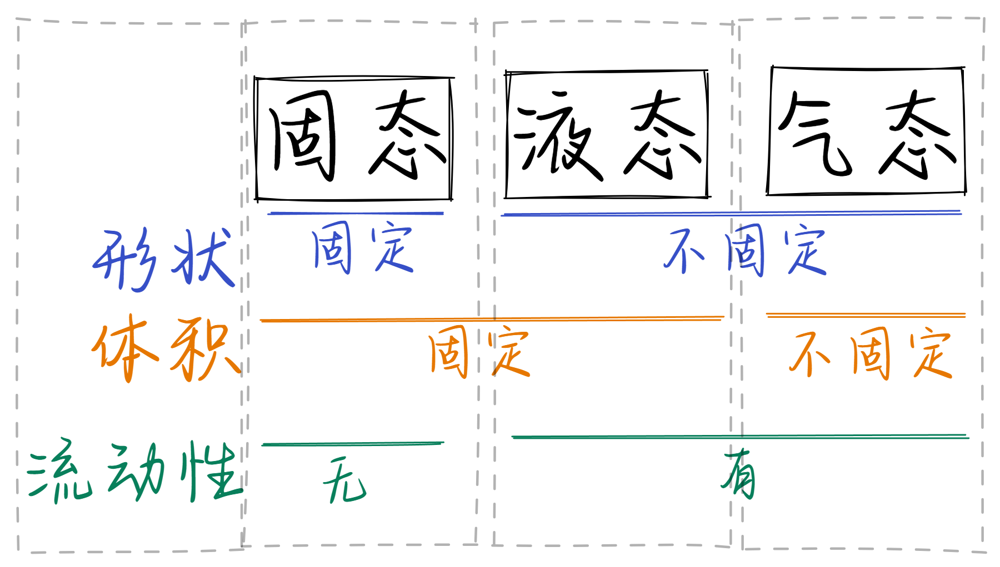
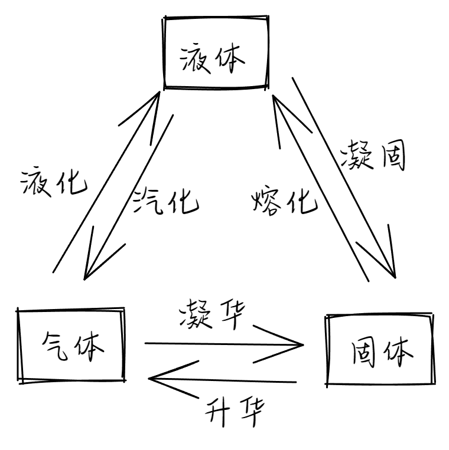
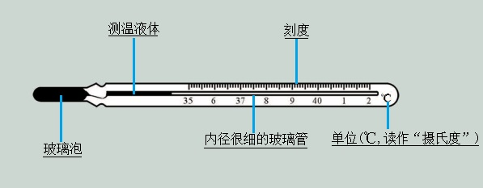

# 1.1 物态变化 温度
## 物态
### 物态
自然界中常见的物质可以三种状态存在：`固态`、`液态`和`气态`.
### 物态特征：
|物态|形状|体积|流动性|
|--|--|--|--|
|固态|固定|固定|无|
|液态|不固定|固定|有|
|气态|不固定|不固定|有|

### 物态变化
物质由一种状态变为另一种状态的过程称为`物态变化`.

## 温度
在物理学以及生产、生活中，我们用`温度`, 表示物体不环境的冷热程度. 
   
温度单位有`℃`(摄氏度)、`℉`(华氏度)和`K`(开尔文)等.  
### 大气压
大气压就是大气产生的压强. 为了便于对比, 人们通常把 $1.01\times 10^5\; Pa$ 的大气压叫做一个大气压.  
### 摄氏度
- 摄氏温度规定, 在大气压为 $1.01\times 10^5\; Pa$ 时,
- 把<u>冰水混合物</u>的温度规定为`0`度, 而把<u>水沸腾</u>的温度为`100`度,   
- 把0度到100度之间分成`100`等份, 每一等份称为1摄氏度,   
- 用符号`℃`表示,记为1℃. 摄氏度用符号`t`表示.
### 华氏度
- 华氏温度规定, 在大气压为 $1.01\times 10^5\; Pa$ 时,   
- 把<u>冰水混合物</u>的温度规定为`32`度, 而把<u>水沸腾</u>的温度为`212`度,   
- 把32度到212度之间分成`180`等份, 每一等份称为1℉.  
- `℉`是华氏温度的单位.  
- 摄氏度与华氏度的换算关系: $华氏温度=32+摄氏温度\times \frac{9}{5}$.  

|在标准大气压下|摄氏温度|华氏温度| 
|--|--|--| 
|冰水混合物的温度|0℃|100℃| 
|水沸腾的温度|32℉|212℉|

## 温度计
日常生活中, 我们常常需要凭感觉判断冷热程度, 这种判断往往很粗略, 甚至不可靠. 要准确地判断物体的温度, 需要利用测量温度的工具——温度计.  
- **原理** 家庭和实验室常用的温度计, 是根据`液体热胀冷缩`的性质制成的.  
- **测温物质** 常用的温度计是`液体温度计`, 里面的物质一般为`酒精`、`水银`或者`煤油`.
- **常用温度计的构成**   

### 温度计种类
①根据`测温物质`的不同分类 $\begin{cases}酒精温度计\\煤油温度计\\水银温度计\end{cases}$   
①根据`用途`的不同分类 $\begin{cases}实验室用温度计\\体温计\\寒暑计\end{cases}$
### 体温计
`体温计`的玻璃泡与毛细管之间有一个`极细且弯曲的缩口`. 有了它体温计离开人体也能读数.