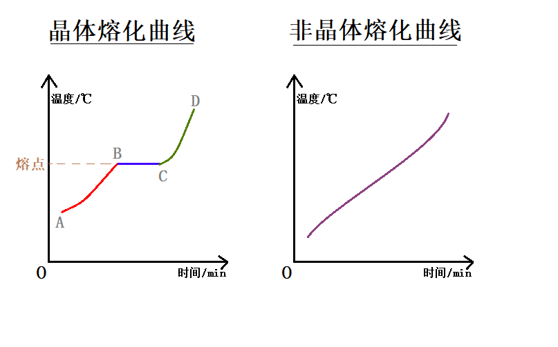

# 1.2 熔化和凝固
## 熔化和凝固
<u>`熔化`</u>是指`固体`**吸热**变为`液体`.  
<u>`凝固`</u>是指`液体`**放热**变为`固体`.
### 熔化与溶化
- **熔化** 固体物质吸热后变为液体的过程.  
- **溶化** 固体物质在另一液体中逐渐分散开的过程.  

冰化为水是`熔化`, 盐在水中化开是`溶化`.
## 晶体与非晶体
- 如下图的`晶体熔化曲线`, 物质一直在加热中, 一开始, 晶体温度升高, 到达`熔点`( $\textcolor{blue}{蓝色部分}$ )时, 虽然<u>继续加热</u>, 但<u>温度保持不变</u>.  
- 图中的`非晶体熔化曲线`, 物质一直在加热中, 随着加热时间的延长, 物质温度逐渐升高, 在此过程中<u>物质变软, 然后逐渐变稀, 最后熔化为液体</u>.

在晶体熔化曲线中:  
- 在AB段( $\textcolor{red}{红色部分}$ )为固体, 是升温阶段.
- 在BC段( $\textcolor{blue}{蓝色部分}$ )处于固液共存状态, 是熔化过程, 在B点时是固体, 到了C点成了液体.
- 在CD段( $\textcolor{green}{绿色部分}$ )为液体, 是吸热升温阶段.
在晶体熔化曲线中:  
- 物质不断吸热, 温度不断上升.  
- 在此过程中固体由硬变软再变稀, 最后熔化为液体.
    - **固体 $\to$ 变软 $\to$ 变稀 $\to$ 液体**
  

**晶体** 在熔化过程中吸收热量, 温度保持不变, 具有确定熔化温度的固体.  
**非晶体** 在熔化过程中吸收热量, 温度升高, 没有确定的熔化温度的固体.

- 从有无熔点来判断. 晶体有熔点, 非晶体没有熔点.
## 熔点
只有晶体有熔点.(或者说: 有熔点的物质是晶体)  
