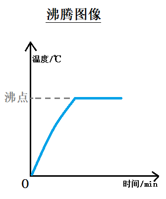

# 1.3 汽化和液化
## 汽化和液化
**汽化** 指物质由<u>液态</u>变成<u>气态</u>的过程.  
**液化** 指物质由<u>气态</u>变成<u>液态</u>的过程.
## 汽化
汽化有两种方式: `蒸发`和`沸腾`.
### 蒸发
`蒸发`指在液体**表面**进行的的汽化现象, 它在**任何温度下**都能发生, 蒸发过程中需要**吸热**.  
#### 影响蒸发快慢的因素
|因素|例如(前提:同样的湿衣服)|
|--|--|
|**液体的温度越高, 蒸发越快**|晾在阴凉处干得慢|
|**液体的表面积越大, 蒸发越快**|晾在同一个地方, 展开干得快|
|**液体表面附近的空气流动越快, 蒸发越快**|挂在有风的地方干得快|

**总结:** 液体**温度**越高, **表面积**越大, 表面附近的**空气流动速度**越大, 液体蒸发得越快.  
- **蒸发也吸热!!!**
### 沸腾
加热液体, 液体将:  
  
在上图中, 液体温度逐渐升高, 到达沸点继续加热, 但温度保持不变, 液体内部和表面发生剧烈的汽化现象.  
  
停止加热后, 水立刻停止沸腾, 温度开始下降.
- **液体沸腾的条件:** ①到达沸点②继续吸热.
- **沸点与气压的关系:** 气压越大, 沸点越高; 气压越小, 沸点越低.
## 液化
液化有两种方式: `降低温度`和`压缩体积`.  
- 液化过程中<u>放热</u>.
- 含有`雾`、`露`、`“白气”`、 `“白露”`、`“出汗”`等字眼的都是汽化现象.